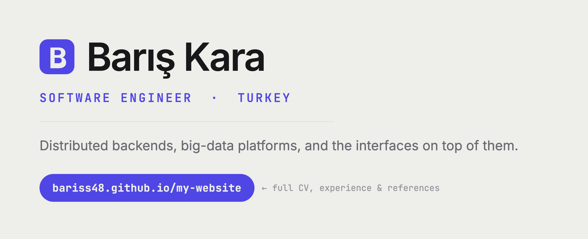

<!-- The whole banner is a link to the portfolio, so the biggest thing on the
     page is also the click target. -->
<a href="https://bariss48.github.io/my-website/">
  <picture>
    <source media="(prefers-color-scheme: dark)" srcset="assets/banner-dark.png">
    
  </picture>
</a>

<h3 align="center">
  <a href="https://bariss48.github.io/my-website/">🌐&nbsp; bariss48.github.io/my-website</a>
</h3>

  <a href="https://linkedin.com/in/berkbariskara">LinkedIn</a> &nbsp;·&nbsp;
  <a href="mailto:berkk.baris48@gmail.com">Email</a> &nbsp;·&nbsp;
  <a href="https://randevusaatim.com">RandevuSaatim</a>

---

### whoami

Software engineer with 6+ years of building products end to end, from
distributed, queue-driven backends to the interfaces on top of them. I care
about simple solutions, readable code, and shipping things people actually use.

- 🏗️ Building **[RandevuSaatim](https://randevusaatim.com)**, an online booking
  and business-management platform for appointment-based businesses.
- 🔌 Shipped **50+ third-party API integrations** at Monkedo (Discord, Slack,
  Notion, GitHub, Google Drive, Microsoft Office), and led code reviews for a
  small team.
- 🌍 Turkey. Open to new opportunities.

<!-- GitHub renders [!IMPORTANT] as a coloured, icon-marked callout, which is
     what makes this block catch the eye instead of reading as one more
     paragraph. -->
> [!IMPORTANT]
> ## 🎓 Master's Thesis
>
> **High-Performance Distributed Big Data Analytics Platform** 
> M.Sc. in Computer Engineering, Pamukkale University, supervised by
> Prof. Dr. Serdar İplikçi. Graduated with a 3.54 / 4.00 GPA.
>
> An FP-Growth / Eclat / H-Mine analytical core sitting behind a
> RabbitMQ-decoupled worker pool. Socket.io streams live progress, a chunked
> upload path ingests datasets up to **1 TB**, and Redis tracks job state.
> Auth0 handles OIDC identity so datasets stay with authorized users.
>
> `Python` `RabbitMQ` `Redis` `Socket.io` `Auth0` `Docker`
>
> ### ➜ [Read the full write-up](https://bariss48.github.io/my-website/#experience)

### What I reach for

- **Frontend:** Next.js / React · Angular · Tailwind CSS · HTML & CSS
- **Backend:** Node.js · Nest.js · MongoDB · RabbitMQ · Redis
- **Languages:** JavaScript · Java · Python · C / C++
- **Tools & infra:** Docker · Kubernetes · AWS · Git

---

  Full experience, education and references on
  <a href="https://bariss48.github.io/my-website/">bariss48.github.io/my-website</a>

